# Aquila Ticket Tracker

This project streamline the issue tracking processes. Implemented by using Spring Boot for backend development and Angular for a user-friendly, web-based interface. 

###  Key Features:

 - #### User Management:
   * Account creation with secure password hashing.
   * Login functionality with authentication.
   * Role Base User Authentication.
   * User profiles for managing account details.
   
 - #### Project Management:
    * Create Project.
    * Manage Users and Tickets of Project.

 - #### Ticket Management:
    * Creatation of Ticket.
    * Management of Ticket and Assignee of ticket to team member.
    * Comments on ticket.

### Technology Stack:

 - Backend (API): Spring Boot (Java)
 - Frontend (client): Angular (TypeScript)
 - Database: MySQL

### Project Structure:

```
aquila-ticket-tracker/
├── assets/
├── api/  # Backend (Spring Boot) project
│   └── ... (Spring Boot project files)
├── client/  # Frontend (Angular) project
│   └── ... (Angular project files)
├── docker/  # Docker compose file for setting database
└── ...  README.md  # This file
```

### Getting Started:

### Prerequisites:
- Java 11
- Maven
- Node.js and npm
- Docker

### Using Docker Container:
- Set up Aquila using Use docker compose file: [Compose file](docker-compose.yaml)

```bash
docker compose up -d
```

### Run Locally

#### Installation
- Clone the repository:

```bash
git clone https://github.com/ManishDait/aquila-ticket-tracker.git
```

- Navigate to the project directory:

```bash
cd aquila-ticket-tracker
```

- Set up MySQL and Mailhog:

```bash
cd docker
docker compose up -d
```

- Install Maven dependencies:
   
```bash
mvn clean install
```

- Install Node dependencies:
  
```bash
cd client/aquila-ui
npm install
```

#### Running the Application:

- Start the backend server:

```bash
mvn spring-boot:run
```

- Build and serve the frontend application:

```bash
cd client/aquila-ui
ng serve -o
```

### Accessing Aquilatracker

During development or testing, Aquilatracker is accessible at http://localhost:4200 and Mailhog at  http://localhost:8025 in your web browser. Use the provided credentials to log in initially. Remember to change these credentials after creating a new administrator account.

Username: `Admin` <br>
Password: `P@ssw0rd`

### Demo:

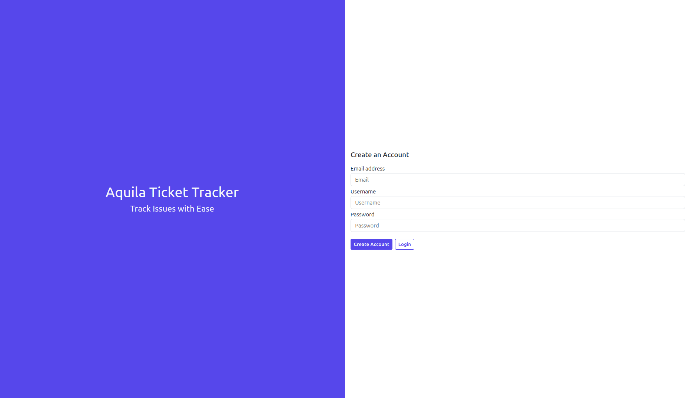

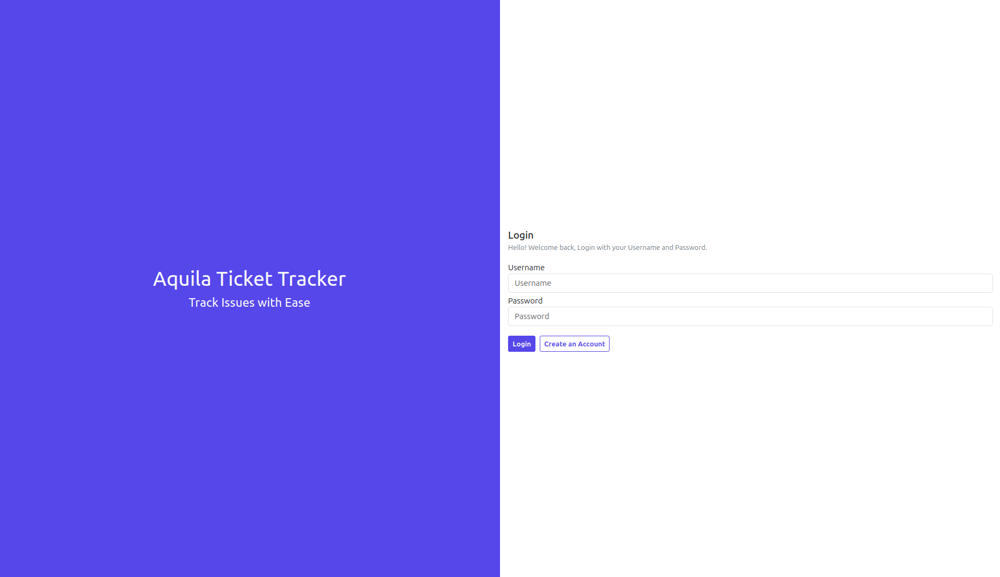

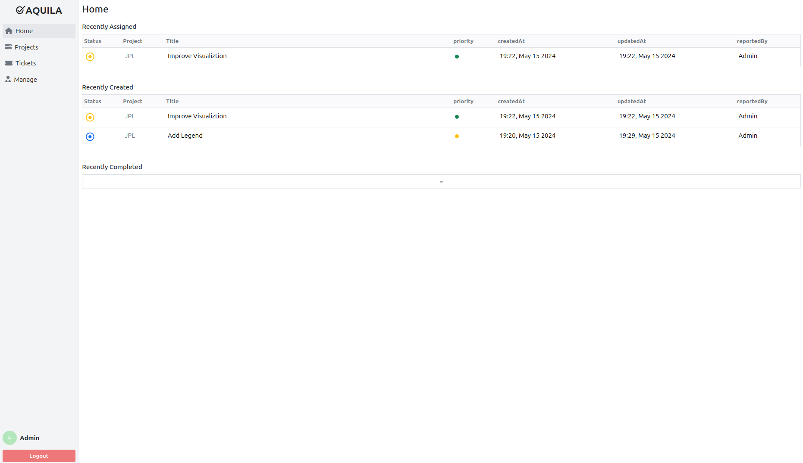

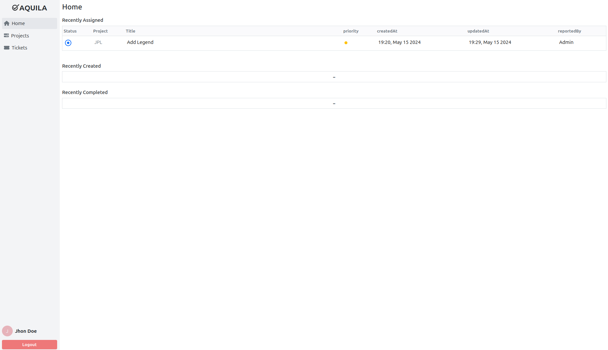

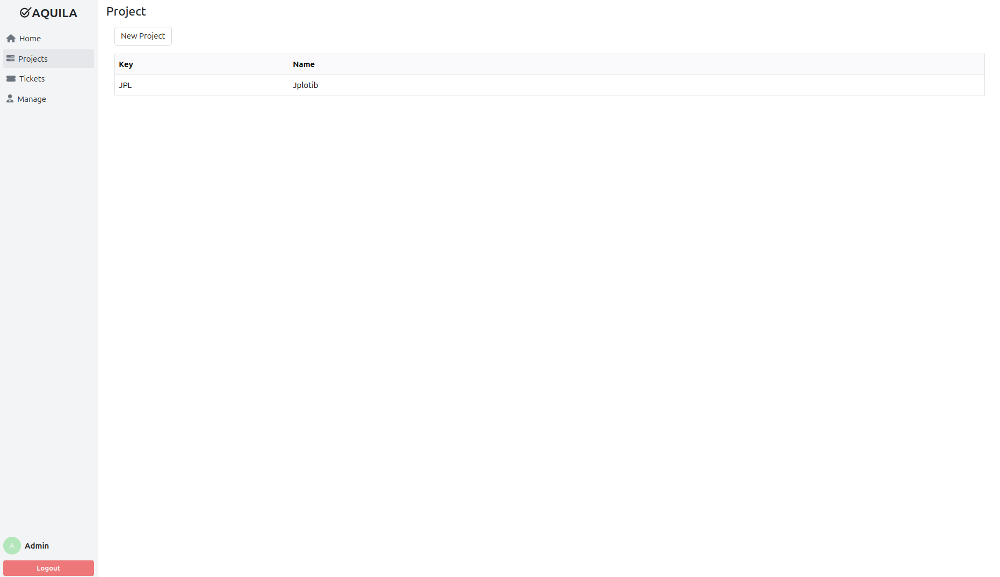

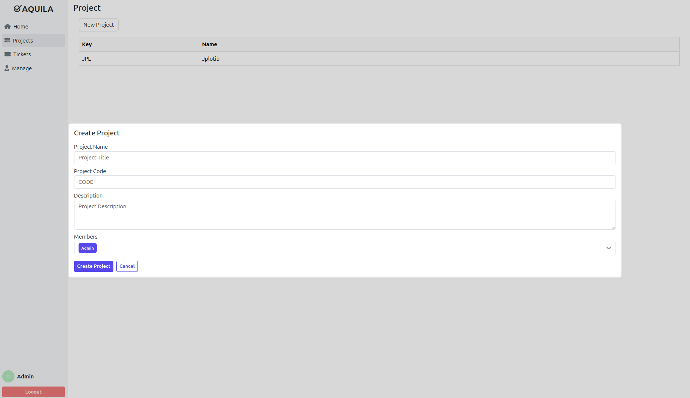

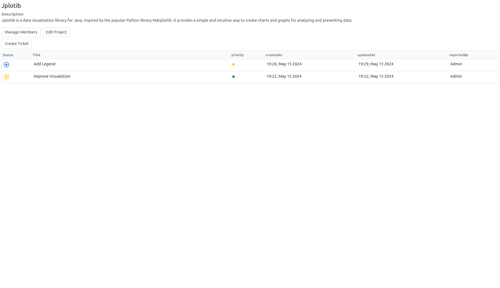

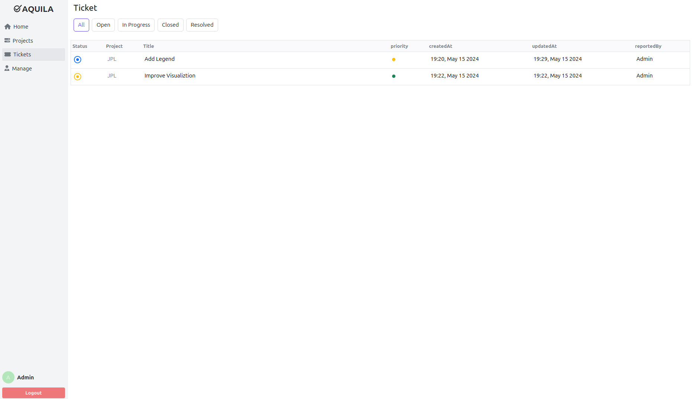

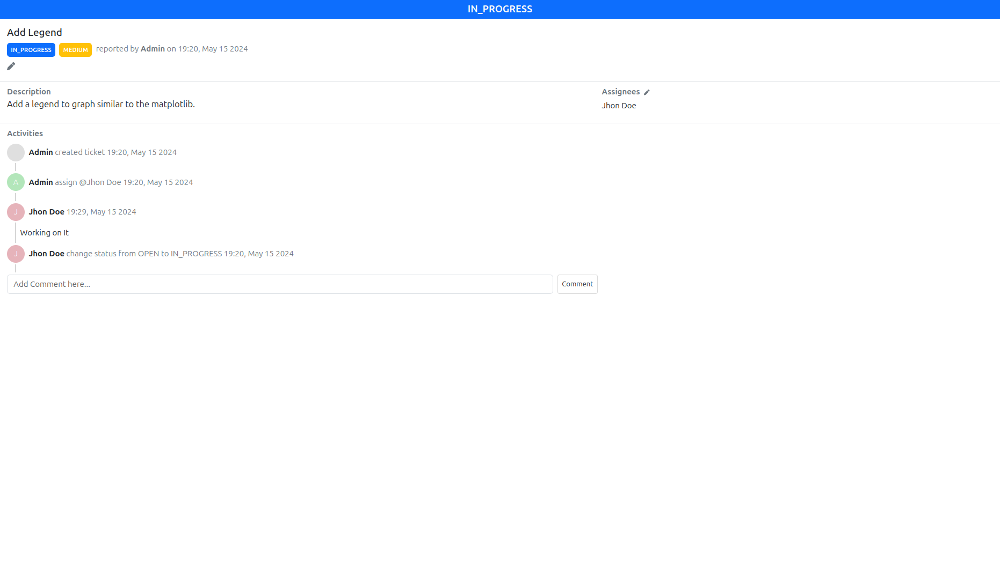

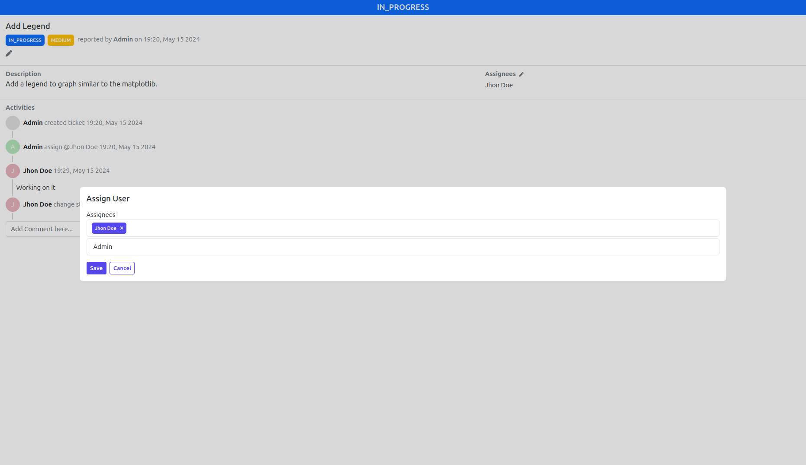

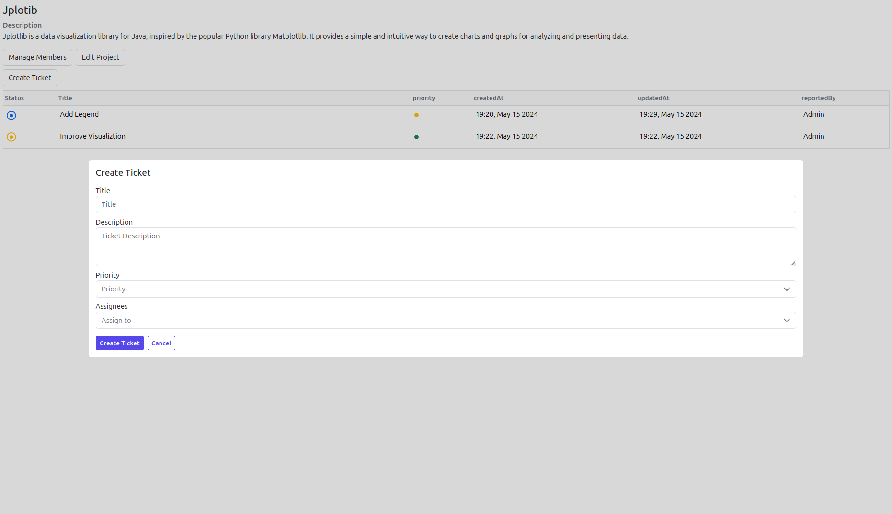

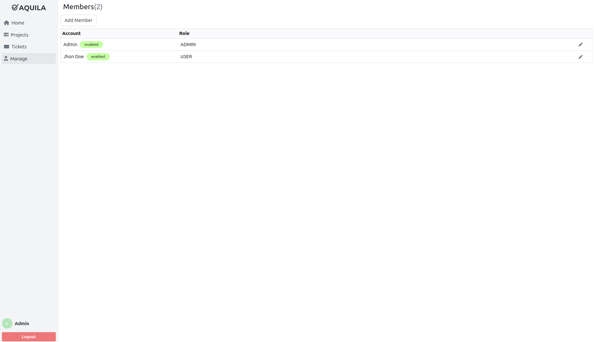

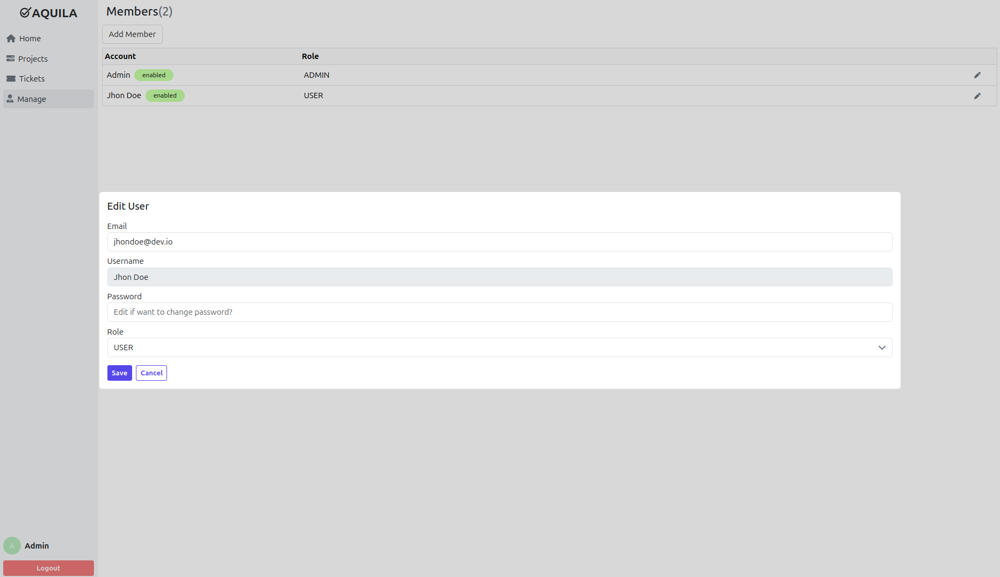


